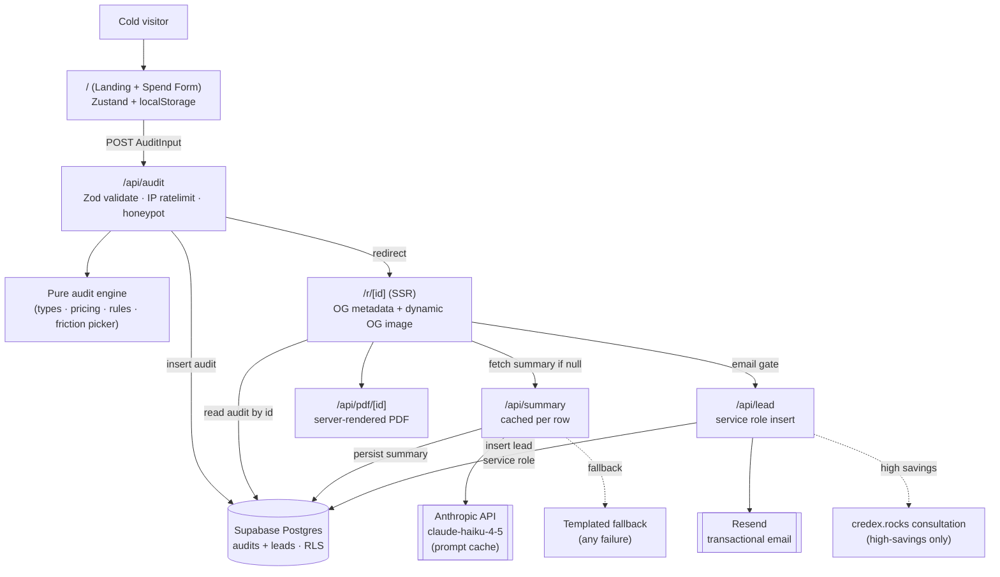

# ARCHITECTURE.md

## System diagram

## Data flow — a single audit, end to end

1. **Form submit (browser).** `SpendForm` collects `AuditInput` (validated client-side via Zod schema in `src/engine/schema.ts`) and `POST`s to `/api/audit`. Form state is mirrored to `localStorage` via Zustand's `persist` middleware so reloading doesn't lose progress.
2. **Rate limit.** `/api/audit` extracts the IP from `x-forwarded-for` and consults Upstash (sliding window, 5/10min). On block: 429 with `Retry-After`.
3. **Engine run.** `auditInputSchema.safeParse` re-validates (defense in depth), then `runAudit(input)` returns an `AuditResult`. The engine is pure: same input → same output, no I/O, no clock, no randomness.
4. **Persistence.** A nanoid (10 chars, ~64 bits entropy) becomes the audit id; the row `{ id, input, result, summary: null }` is inserted via the service-role client.
5. **Redirect.** Browser navigates to `/r/[id]`, a server component.
6. **Result page (SSR).** `generateMetadata` reads the audit row via the *anon* client (RLS lets anon `SELECT audits` but blocks `leads`) and emits OG/Twitter meta plus a dynamic OG image at `/r/[id]/opengraph-image`. The page renders the per-tool breakdown, hero savings, and the conditional Credex CTA.
7. **AI summary (lazy + cached).** A client component fires `/api/summary` *only if* `audit.summary` is null. The summary is generated by `claude-haiku-4-5` with `cache_control` on the system prompt (halves cost across the day's calls). On any failure (timeout 4s, 429, 5xx), a templated fallback is returned instead — and persisted, so a transient outage doesn't permanently degrade the report.
8. **Lead capture.** Below the fold, the `LeadCapture` form posts to `/api/lead`. Honeypot (`website` field) is checked first — bots get a silent 200, no insert. If it's clean, the lead row is inserted (service role, never anon-readable), and Resend fires a confirmation email + a Credex notification email for high-savings cases. Both emails are fire-and-forget so SMTP latency never blocks the user response.
9. **PDF export (bonus).** `/api/pdf/[id]` reads the audit row, renders it via `@react-pdf/renderer` (no headless Chrome), streams the buffer back as `application/pdf`.

## Why this stack

| Layer | Choice | Why |
|---|---|---|
| Framework | **Next.js 15 (App Router) + TypeScript** | SSR for shareable URLs with proper OG/Twitter cards is the load-bearing reason. App Router enables co-located metadata + dynamic OG images via `next/og` — no separate image service. API routes keep the Anthropic key server-side. |
| Type system | **TypeScript strict + `noUncheckedIndexedAccess`** | The audit engine is the kind of code where a stray `undefined` becomes a wrong dollar number. Strictness is a forcing function. |
| Styling | **Tailwind + shadcn/Radix primitives** | Headless Radix gets accessibility right by default (focus management, ARIA, keyboard nav). Tailwind keeps styles colocated with markup. No template aesthetic. |
| Form state | **Zustand + persist middleware** | The assignment requires form state to survive reloads. Zustand's persist is one config line; Redux is overkill, Context loses you the localStorage rehydration. |
| Database | **Supabase Postgres** | Hosted Postgres + RLS. The "anon reads audits, never reads leads" pattern is one policy each; no auth layer needed since reads are fully public. Free tier covers the scope. |
| Email | **Resend** | Cleanest DX. Free tier covers the scope. Templating is just JSX strings. |
| AI | **Anthropic API · `claude-haiku-4-5`** | Cheap + fast for ~100-word summaries; assignment-preferred provider. Prompt caching halves cost. Templated fallback on any failure means the user never sees an error. |
| Rate limit | **Upstash Redis (sliding window)** | Free tier, edge-compatible. Sliding window is more accurate than fixed window for the "5 audits per 10min" rule. |
| Tests | **Vitest** | Fast, modern, native ESM, good TS support. The engine tests run in <1s. |
| Deploy | **Vercel** | First-party Next.js host, edge SSR for OG generation, free tier handles the scope. |

## What I'd change at 10k audits/day

The current setup handles ~100 audits/day comfortably. At 10k/day (~7/min sustained, with bursts):

1. **Move the audit engine to a Cloudflare Worker** at the edge. The engine is pure; cold-start there is single-digit ms. Latency to the user drops below network RTT.
2. **Batch the AI summaries.** Today every audit fires its own Anthropic call (cached, but still serialized). At 10k/day with bursts, queue summaries via BullMQ on Redis and process N at a time with prompt-cached system prompts — the API rate limits start to bind otherwise.
3. **Replace `audits` Postgres rows with KV.** Audits are write-heavy and read-rare (each one is read maybe 2–5 times, usually within 24h). Cloudflare KV or Upstash makes more sense than Postgres at that ratio. Keep `leads` in Postgres for analyst queries.
4. **Pre-render the OG image to R2/S3 once per audit.** Right now it's regenerated on every Twitter scrape. At 10k/day, that's 50k OG image renders. Render on first request, cache the PNG by audit id.
5. **Cron-refresh `PRICING_DATA.md`.** A scheduled job that scrapes vendor pricing pages and opens a PR if numbers change. The current "I check it Day 6" is fine for a take-home but breaks at scale.
6. **Real captcha (Turnstile, hCaptcha) above ~1k audits/day.** The honeypot + IP limit is enough for a free tool people don't have a strong reason to abuse, but if SpendLens becomes the audit-of-record for AI procurement, expect adversaries who care.
7. **Sharding the rate-limit by /16 instead of /32.** Today: 5/10min per IP. At scale, that lets a /20 corporate NAT exhaust the limit for the whole company. Move to a (hashed-email + IP-prefix) composite.
8. **Observability.** Today: `console.warn` in fallback paths. At 10k/day: structured logs to Axiom/Datadog, percentile timings on the engine + AI summary, a per-tool error rate dashboard.
9. **Versioned engine output.** Audit row stores the engine version that produced it. When pricing or rules change, old shared URLs render with the recommendations they were generated under, with a "this audit is N days old, refresh" hint.
